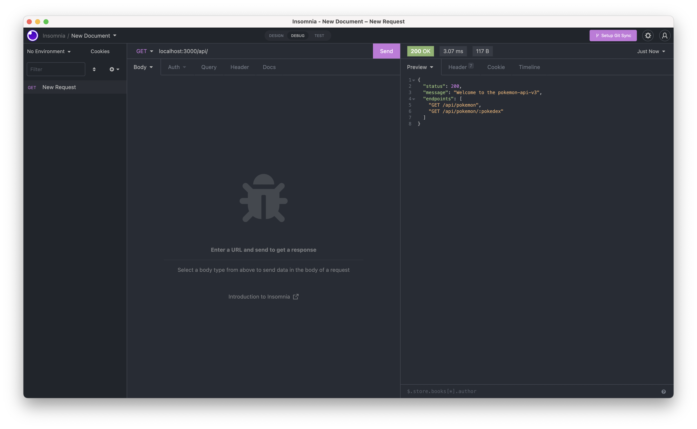
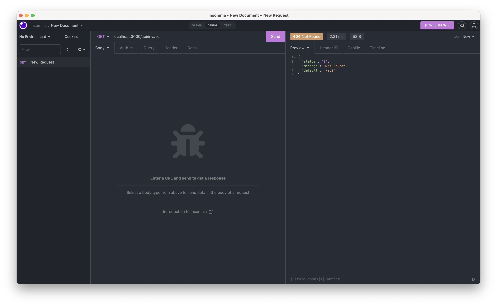
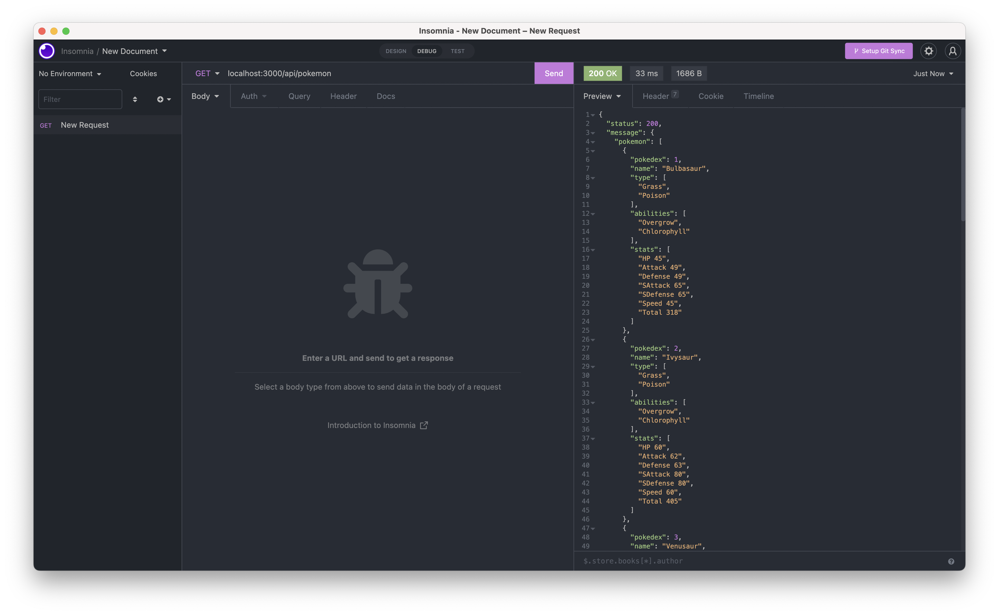
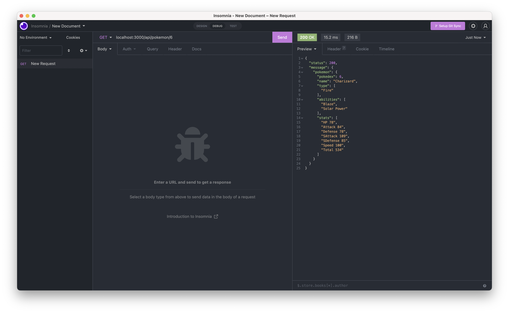

# [Live API](https://pokemon-api-v3.herokuapp.com/api)

```
This app was built with the following Tools and Technologies:

- Express JS
- Node Postgres
- Jest
- Supertest
```

```
If you would like to run the app locally, you can do so by running the following commands:

git clone https://github.com/gwdawson/pokemon-api-v3.git
cd pokemon-api-v3
echo 'PGDATABASE=pokemon_api_v3' > ./env/.env.development
echo 'PGDATABASE=pokemon_api_v3_test' > ./env/.env.test
npm install
npm run database:setup
npm run database:seed
npm start
```

## Screenshots





